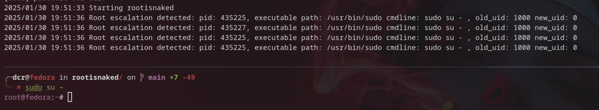
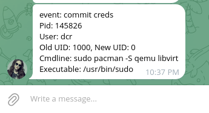

<p align="center" >
<h3 align="center">rootisnaked</h3>
<p align="center">Simple root privilege escalation detection using eBPF</p>
</p>

<p align="center" >
    
    
    
    
    
    
    
    
</p>

---

> Rootisnaked was initially created using [ebpf-go](github.com/cilium/ebpf). The project actually uses [libbpf](https://github.com/libbpf/libbpf) (kernel and user space code written entirely in C). You can find the old version [here](https://github.com/containerscrew/rootisnaked/tree/rootisnaked-go). There is no reason to use C instead of Go in the user space, it's a personal preference to practice C and libbpf. This new version using `libbpf` is missing some features by the moment (like sniffing file permissions changes).


# rootisnaked

`Rootisnaked` is a simple [eBPF](https://ebpf.io/) program designed to monitor changes in user credentials (specifically, the UID) on a Linux system. It hooks into the `commit_creds` kernel function, which is called when a process's credentials are updated. The program detects when a process's UID changes to 0 (root) and logs this event to a ring buffer for further analysis in user space.
It can be used, for example, to detect possible Linux privilege escalation.

> [!CAUTION]
> This is an introduction of eBPF. This tool probably does not cover all possible attack vectors for escalating privileges.

---



```markdown
2025-09-15 22:23:46 [INFO]: Starting rootisnaked
2025-09-15 22:23:46 [INFO]: eBPF program loaded and attached. Waiting for commit_creds_events...
2025-09-15 22:24:01 [INFO]: event=commit creds, user=dcr, tgid=140285, old_uid=1000, new_uid=0, cmdline=sudo su - , executable_path:/usr/bin/sudo
```

<h2 align="center">Telegram Alert Example</h2>
<p align="center">
  
</p>

# Running `rootisnaked`

## Install system dependencies

```bash
sudo apt install -y linux-headers-$(uname -r) vim gcc make clang libbpf-dev curl clang-format libcurl4-openssl-dev build-essential libelf-dev
```

> Tested on `Arch Linux` with kernel version `6.16.5-arch1-1` and `Ubuntu 24.04` with kernel version `6.2.0-26-generic`.

## Compile and run

```bash
make
export TELEGRAM_TOKEN="xxxxx:xxxxx"; export DEBUG=false; export CHAT_ID="xxxxx";  sudo -E ./bin/rootisnaked
```

## Using docker

```bash
sudo docker build -t containerscrew/rootisnaked:latest .
```

> **eBPF code needs to be run under a privileged user or giving capabilities and mounting some required filesystems (proc,sys...)**

```bash
sudo podman run -itd --restart always --name rootisnaked --privileged \
  -e TELEGRAM_TOKEN="xxxxxx:xxxxx" \
  -e CHAT_ID="xxxxxxx" \
  containerscrew/rootisnaked:latest
```

> Using `sudo` because I use podman rootless

# License

**`rootisnaked`** is distributed under the terms of the [GPL3](./LICENSE-GPL3) and [MIT](./LICENSE-MIT) license.
