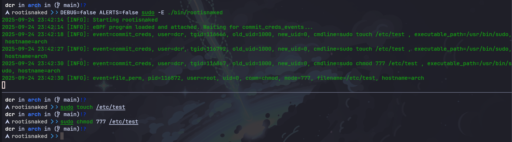

# rootisnaked

<!-- START OF TOC !DO NOT EDIT THIS CONTENT MANUALLY-->
**Table of Contents**  *generated with [mtoc](https://github.com/containerscrew/mtoc)*
- [rootisnaked](#rootisnaked)
- [Running `rootisnaked`](#running-rootisnaked)
  - [Install system dependencies](#install-system-dependencies)
  - [Compile and run](#compile-and-run)
- [TODO](#todo)
- [LICENSE](#license)
<!-- END OF TOC -->



`Rootisnaked` is a simple [eBPF](https://ebpf.io/) tool to monitor owner id (uid) changes in Linux processes. It can be used, for example, to detect possible Linux privilege escalation.

> The eBPF program (kernel space) is written in C and compiled using [cilium-ebpf library](https://github.com/cilium/ebpf). The code in user space is entirely written in Go.

> [!CAUTION]  
> This is an introduction of eBPF. This tool probably does not cover all possible attack vectors for escalating privileges.

# Running `rootisnaked`

## Install system dependencies

> Tested on `debian12` with kernel version `6.1.0-30-amd64`

```bash
sudo apt install -y linux-headers-$(uname -r) gcc git make clang llvm libbpf-dev libbpf-tools bpftool bpftrace
```

* Install Golang: https://go.dev/doc/install (Do not install Golang from the APT repository if using Debian, since it does not have the latest versions)

This page can be helpful https://ebpf-go.dev/guides/getting-started/#ebpf-c-program

## Compile and run

```bash
make build-run #if using arm64, change GOARCH in Makefile
```

# TODO

- Comment the code for better understanding


# LICENSE

[`license`](./LICENSE)
